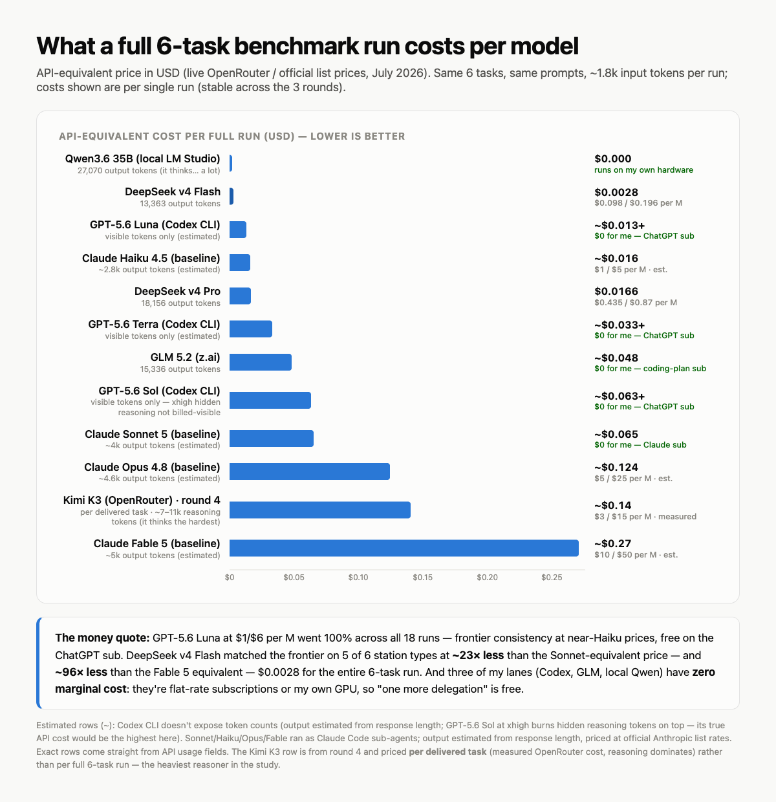
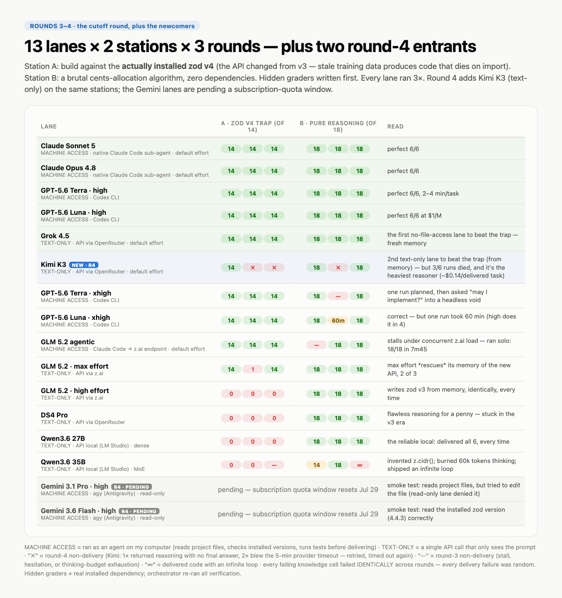

# multimodels-mcp

**Delegate tasks from Claude Code to other companies' models — without leaving the app.**

This is a small MCP (Model Context Protocol) server that acts as a "waiter" between your main coding agent and every other model you have access to. Claude Code stays the orchestrator; the waiter takes an order to whichever kitchen you point at:

- **Codex CLI** → GPT-5.6 Sol / Terra / Luna via your ChatGPT subscription (no API cost)
- **DeepSeek** (DS4 Flash / Pro) via direct API
- **z.ai** (GLM 5.2) via the coding-plan subscription
- **OpenRouter** → anything in their catalog
- **LM Studio** → local models on your machine or another box on your LAN, for free

The same pattern works for any MCP-capable agent — nothing here is Claude-specific except where it's registered.

## Tools exposed

| Tool | What it does |
|---|---|
| `list_models` | Returns the menu: every enabled model with its exact id and provider status (missing key, offline local server, etc.) |
| `delegate_task` | Sends a self-contained task to the chosen model and returns its answer, tagged with origin and token usage |

Delegation niceties, all born from the benchmarks below: pick the Codex model per call (`codex:gpt-5.6-luna`), set reasoning effort per call (`effort` works for Codex, z.ai and OpenRouter), **per-provider concurrency queues** (z.ai and LM Studio silently choke on parallel calls — the server now queues them), configurable per-provider timeouts, and **automatic retry** on network drops / 429 / 5xx (the answer footer says `repescada 1×` when the second attempt saved the day).

## Quick start

```bash
git clone https://github.com/dpmadsen/multimodels-mcp.git
cd multimodels-mcp
npm install
npm run build

# copy the key template and fill in what you use
cp .env.example .env

# register in Claude Code (user scope = available in every project)
claude mcp add --scope user multimodels -- node "$(pwd)/dist/index.js"
```

Then ask Claude: *"use the list_models tool and show me the menu"*.

## Configuring providers

- **`config/models.json`** — which providers exist, their base URLs, and which models are enabled. Adding an OpenAI-compatible provider is one JSON block; enabling a model is one line in its `models` array.
- **`.env`** — API keys only. Never in models.json, never in code. The server reads models.json fresh on every call (edit and it applies immediately); `.env` is read at startup (restart the server after adding a key).
- **Local control panel** — `npm run panel` opens a localhost page (http://127.0.0.1:4747) to manage keys and toggle models. Keys are shown last-4-only; the panel binds to localhost.
- **Codex lane** — needs the [Codex CLI](https://github.com/openai/codex) installed and logged in. It uses whatever model your `~/.codex/config.toml` sets (the CLI accepts `-m gpt-5.6-luna` etc.).
- **z.ai gotcha** — coding-plan subscription keys only work on the coding endpoint (`https://api.z.ai/api/coding/paas/v4`). On the generic endpoint they fail with a misleading "insufficient balance". The default config already points at the right one.

## The benchmark: who can you actually trust with delegated work?

The [`benchmark/`](benchmark/) folder contains a full evaluation run through this server: **6 stations × 11 models × 3 rounds = 198 runs**, graded by hidden test suites written *before* any model saw the tasks. Stations: build-from-spec, find-and-fix-a-bug, code review with seeded bugs, strict JSON extraction, a long compound deliverable, and honesty under missing context.


Highlights:

- The GPT-5.6 Codex family (including Luna at $1/M input) went **54/54 perfect runs**, and verified 9/9 times that a phantom file didn't exist instead of hallucinating a fix.
- Sonnet 5 and Haiku 4.5 failed the same cent-distribution contract in 2 of 3 rounds each — while every cheap delegate passed 9/9.
- Strict JSON extraction: 33/33 across all models. Solved problem.
- Single-run benchmarks lied in both directions; three rounds changed half the conclusions.

Everything needed to reproduce is in the folder: station prompts (`benchmark/estacoes/`, in Portuguese), automated graders (`benchmark/corretores/`), and every raw response (`benchmark/respostas/`).



### Round 2 — a real task instead of synthetic stations

Seven implementers (Claude, GPT-5.6 and GLM lanes, agentic and text-only) built the **same real feature** of this very server, each on an isolated git branch, judged by 12 hidden acceptance checks: [`benchmark/rodada2-implementacao/`](benchmark/rodada2-implementacao/). Sonnet 5 won on fine-grained review; the text-only lanes revealed their two blind spots (context and verification).

### Round 3 — the knowledge-cutoff round

Designed by the Reddit comment section: 13 lanes × 2 stations × 3 rounds, with reasoning effort controlled and a station built against the **actually installed zod v4**: [`benchmark/rodada3-esforco-e-cutoff/`](benchmark/rodada3-esforco-e-cutoff/). The cheap models didn't fail at reasoning — they failed at knowing what year it is (0/14 nine-for-nine on the trap, 18/18 on pure reasoning). Only two defenses exist: file access, or fresh training data.

### Round 4 (partial) — the newcomers

Two requested lanes on the same two stations: [`benchmark/rodada4-raias-novas/`](benchmark/rodada4-raias-novas/). **Kimi K3** (text-only, via OpenRouter) ran and became the **second text-only lane ever to beat the cutoff trap** — 14/14 on the zod v4 station from memory alone, joining Grok 4.5 in the "fresh memory" club. But its delivery is shaky: heavy reasoning (6.5–11.4k reasoning tokens per answer) blew the provider's 5-minute timeout on 3 of 6 runs, and it's pricey (~$0.14 per delivered task, $3/$15 per M — reasoning dominates). The two **Gemini** lanes (3.1 Pro high and 3.6 Flash high) are **pending** — the Google subscription quota ran out; that window resets ~Jul 29.



There's also an interactive decision report (in Portuguese) consolidating all rounds: [`benchmark/relatorio-decisao.html`](benchmark/relatorio-decisao.html).

## Repo notes

- This project is built entirely through vibecoding, in Portuguese. The originals stay in Portuguese as part of how it's made, and every document has an English version: [CLAUDE.en.md](CLAUDE.en.md) (working instructions), [CHANGELOG.en.md](CHANGELOG.en.md) (project diary), [benchmark/README.md](benchmark/README.md) (benchmark guide) and [benchmark/estacoes/en/](benchmark/estacoes/en/) (station prompts).
- The benchmark ran with the Portuguese prompts; the raw model responses in `benchmark/respostas/` are untranslated on purpose — they're the evidence. The graders are language-independent.
- Tests: `npm test`.

## License

[MIT](LICENSE)
